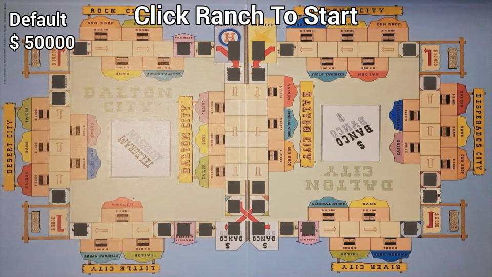
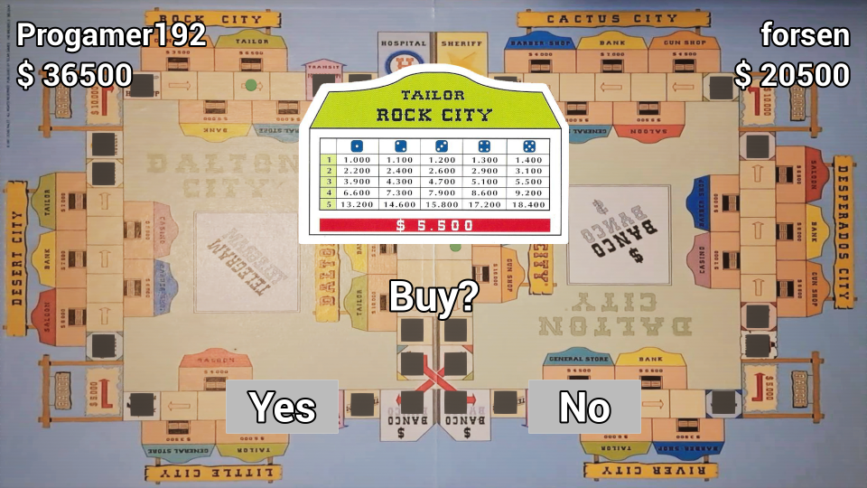

# Welcome To Dalton City!

## Description
Dalton City is a board game made by Telar Games from 1997.  
This game also isn't being made anymore and I cannot find anything about Telar Games if they are still around or not.  

As I love playing this game, it is getting hard to find people to play it with irl.  
Thus resulting in me shooting my shot at recreating it for PC.  

At first this project looked very easy to pull off, yet then reality struck.  
Prior to this I had no knowledge on how to make an online multiplayer game.  
This game would've been fairly easy to recreate without multiplayer, but I like a good challenge so didn't think much about it and got straight to work.  

This entire project will be done in Unreal Engine 5+.  
As of writing this, the project was started in UE 5.2, yet 5.3 got released recently and I'm still thinking if I'd update it or not.  

 

 ## Before you play
 Keep in mind that this game is currently not finished yet.  
 A lot of the main mechanics are still not finished.  

 To play Online Multiplayer, the host (the one that creates a game), needs to forward port 7777 UDP.  
 Then you need to give your IP address to the other players who can then use that to join their game.  

 **Disclaimer: NEVER give your IP address to people who you don't trust. I will not be responsible if you give it to the wrong people.  **
 
 Currently the game supports a max of 4 players. It can be played solo, but there is no way to end the game like this.  

 ## Current Mechanics

These are the mechanics that are already in the game, which are also in the real game:  

### Buying Trade Tiles
Whenever you land on a trade tile and have enough money to buy this, and option will appear that lets you inspect this tile and gives you the option to buy it.  
The price of this tile is also mentioned on the info card.  

 

Whenever a player is on the opposite side in Dalton City, they also get the option to buy that Trade Tile.

### Paying Trade Tiles
Whenever you land on the Trade Tile of another player, you have to pay up.  
The tile info will pop up and say which row is active.  

What this means is the amount of tiles of that type the creditor owns affects how much you pay.  
The first row will always be the cheapest, while the last row will be more expensive.  
 
The column that is selected will be decided by a dice throw.  
Just 1 dice will be thrown and whatever it lands on, take the row and column, that will be the owed sum.  

 

But you may notice there is not a column for a 6-roll.  
When this happens, ***Stealing Trade Tile*** will be triggered and you don't have to pay anything.  

### Stealing Trade Tile
This is activated when a player rolls a 6 in the pay menu.  
The player will get another 1 dice roll.  

If this lands on a 1 - 5, nothing happens.  
But in the case that it lands on another 6, the player will steal the trade tile from the creditor without having to pay anything at all.  

### The Pawn
The pawn is a special one.  
It has 2 forms
- Regular
- Horse  

The regular pawn is limited to 1 dice when rolling for their turn.  
While the horse has the option to pick 2 or 1 dice when rolling for their turn.  

Whenever the player rolls a 6 for their turn, the horse will be activated.  
The horse can be lost, but not yet in this version.  

Normally the pawn should be displayed differently on the map, but this isn't added yet.  

### Ranch
Whenever a player lands on a ranch, they will gain the amount of money the sign indicates.  
This is either $5 000 or $10 000.  
To start the game, every player needs to select a ranch too, in this case the effect will not be activated and players do not gain that money.  

## Missing Mechanics
This is a list of the mechanics I still need to add to the game.  

### Color Selection
In the beginning, each player should be able to select a color.  
This color should be used for the pawn, and in the game every horse has a different name.  

### Diploma
The diploma is a key part of the game.  
You can buy these if you land on a tile and pay the amount requested.  

If someone lands on your trade tile and you have a diploma of that type, the money that they have to pay will be doubled.  

If you land on another players trade tile and you have a diploma of that type, the money that you have to pay will be halved.  

There is another rule that whenever a player lands on a diploma tile that is owned by another player, the owner will get 10% of the purchase value of that diploma.  
But if the owner owns multiple diplomas, the money owned will be multiplied by the number of diplomas the owner holds.  
(eg, the owner holds 3 diplomas -> 10% X 3, 30% is owed)  

### Trade Tile Payment Influence
As mentioned before, diplomas could double or halve the price that needs to be paid.  
There is 1 more thing that can influence this  
When a creditor owns all trade tiles in a city, the amount owed get's doubled.  

This stacks up, so if they own all cities and have the correct diploma, the amount owed can get quadrupled.

### Transit Tiles
There are 3 different Transit Tiles on the board.  
Each has a different price.  

If you land on a transit tile that you already own, you have the choice to go to any trade tile you want, without being forced to purchase it.  

If you land on a transit tile and you own all of them, you have the choice to go to any tile on the board, without being forced to purchase it if applicable.  

If you land on a transit tile that another player owns, you have to pay the sum mentioned on the bottom according to how many transit tiles the creditor owns.  

### Daily Star & Post Office
If you land on either of these tiles you will receive the correct card.  
If another player currently owns that one, they will lose it.  

The effects of both cards are as follows:  
**Post Office:** 50% discount when buying a card.  
**Daily Star:**  50% discount when paying someone else.  

These cards can be used whenever the player likes, but can only be used once.  
Yes these can be combined with other cards if you want.  

### X $500  and X $1 000
If a player lands on these tiles, they will receive a sum of money worth of (their roll to get on the tile X 500 or X 1 000).  
E.g. A player lands on the tile after rolling a 4, they get 4 X 1 000 = $4 000.  

### Telegram Cards
These cards are have random prompts on them, could be good, bad or neutral.  
These prompts will then be executed.  

### Banco
Banco can collect everything, usually via prompts.  
If a player lands on either Banco tile, they will get everything the Banco is currently holding.  

### Hospital and Sheriff
If a player either lands on one of these tiles or gets sent to one of them, they lose their horse if applicable.  

When inside Hospital, the player:  
Only receives 50% of their earnings. (trade tiles, diplomas,...)  

When inside Sheriff, the player:  
The player does not receive any earnings. (trade tiles, diplomas,...)  
Additionally the player has to give up a card (trade tile, diploma,...) to Banco  

To get out of either tiles, the player has to roll 2 dice.  
When 1 dice is a 6 or they roll a doubles, they can get out and as many steps as they rolled.  

If the player does not get out:  
On the first try, they have to pay $1 000 to Banco.  
On the second try, they have to pay $2 000 to Banco.  
On the third try, they have to pay $3 000 to Banco.  
Once the third try has been paid, they can advance with the amount they rolled.  

### Wanted and Rodeo
Landing on those tiles will trigger these effects:  
**Wanted:** the player goes to the Sheriff tile.  
**Rodeo:** the player goes to the Hospital tile.  

### Hold Up
Landing on this tile, the player has to pay half of their money to Banco.  

### Duel
Whenever 2 players land on the same tile, with the exception of "Hospital", "Sheriff" and "Banco", a duel will ensue.  

Both players will need to roll 1 dice.  
The highest rollers wins and gets to stay on the tile.  
The loser goes to the "Hospital" tile. (Loses horse if applicable)  

The winner should also get to steal 1 card from the loser.  
This being a Trade Tile, Diploma,...  

In the event of a tie, the players will roll again but with the chance of stealing 2 cards.  
If a tie happens again, roll again and steal 3 cards. Repeat until there isn't a tie.  

When a duel occurs, the effects of the tile the players are standing on will NOT be executed.  

Currently I provided an option to each tile to check if battle is enabled or not.  
If a duel happens, the effect of the tile just doesn't execute and a debug line is printed.  
Nothing else is implemented yet.  

### Golden Nugget
Landing on this tile, the player gets the Golden Nugget.  
If another player currently has it, they will lose it.  

With this nugget, the player can pay ANY transaction.  
Purchasing trade tiles, diplomas, paying debt, using it at a hold up,...  

## Other features that might get added
Will have a list here of features that might get added, what a suprise.  
If you have anything you think would be nice, feel free to contact me.  

Talking to the player. Currently when the other players are having their turn, you don't see anything, just their money going up or down. I will try to make an overlay that can display everything happening 
Saving Player Name after quitting the game.  
Optimizing the game. Currently I have no clue how optimizing works in UE, so 99% of your GPU will be used.  
Ability to sell properties. (this is a thing in the real game)  
Setting an amount of game turns. (also a thing in the real game)  
Playing against bots.  

## End Of The Game
The game will end whenever all but 1 player has gone bankrupt.  

But later on it could also end whenever all turns have ended, specified by the creator.  
When this happens, all values will be counted up and the player with the most money will win.  

## In Conclusion
I want to end this ReadMe with thanking Telar Games for publishing this game.  
Big shoutout to the creator: Denis Ralet. 

Again I do not own anything shown in this game nor will I claim that I do, all cards are from the boardgame, so is the board itself.  

If there are any problems with me having this public, feel free to contact me.  
I do not intend to make any money with this, this is purely something for my portfolio and other people to enjoy player since you cannot buy this game anymore.  
